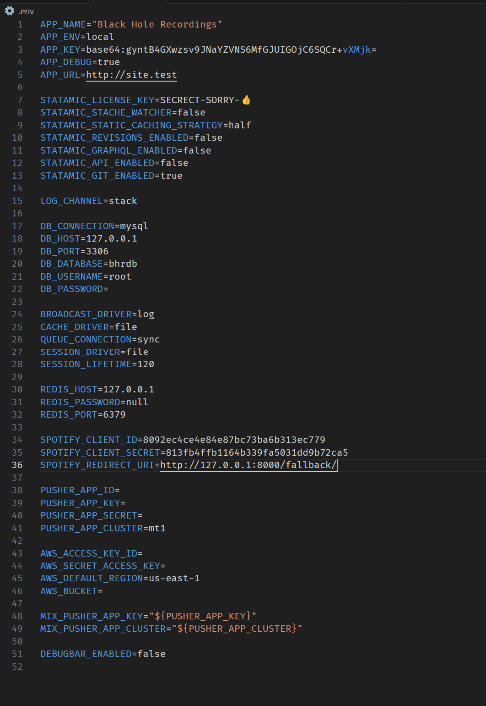
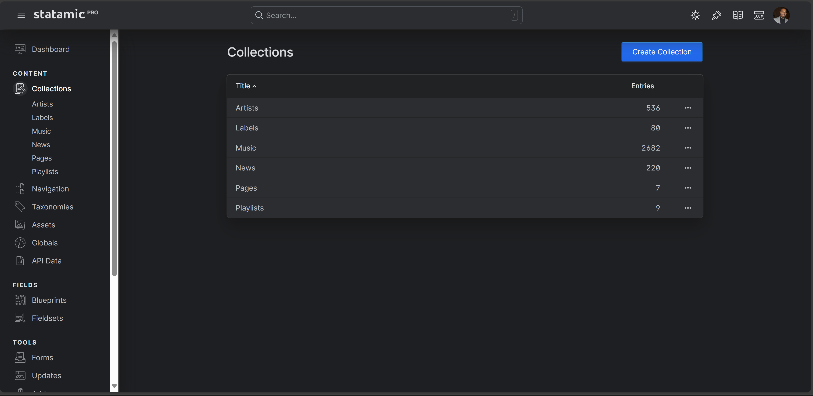
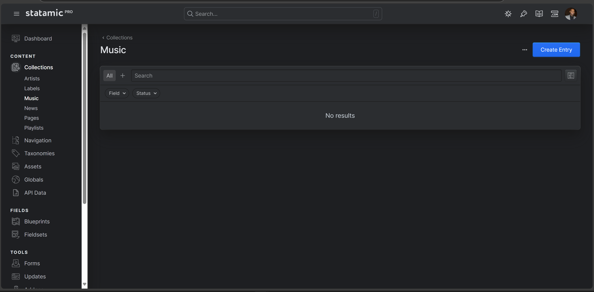
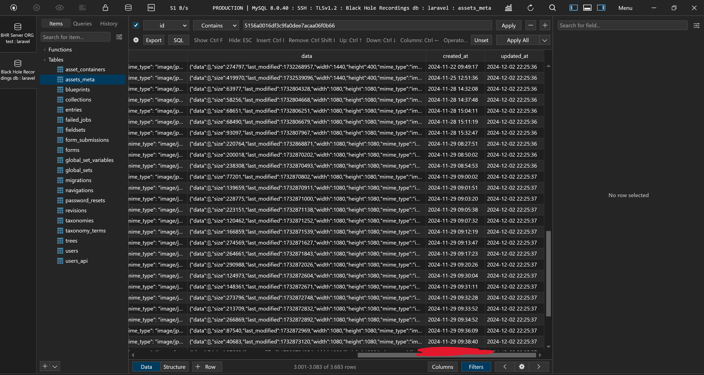
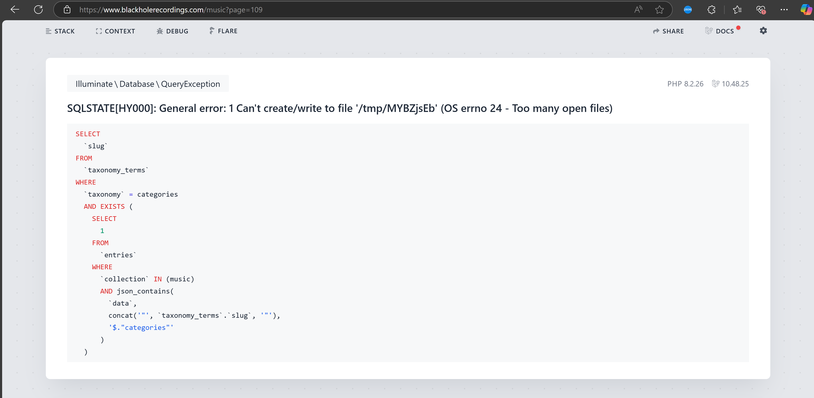
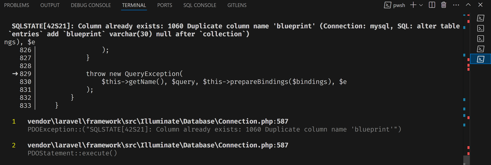

### **1. Title**

Issues After Upgrading from Statamic v4 to v5

---

### **2. Description**

**Summary:**

* Images in `public/assets` are not fully visible in the control panel.
* Collection list is visible, but some entries are missing.
* Performance has slowed noticeably.

#### Example:

> When I go to `cp/collections`, I see all collections but not all entries or some of collection's entries are completely empty. Pagination some of the pages gives back 500 error, and overall performance is slowed compared before upgrade.

---

### **3. Steps to Reproduce**

**Step-by-step instructions to replicate the issue.**

1. Back-up both db and public/assets
2. Upgrade Laravel 9 to 10
3. Statamic 4.6.0 to 5.41.0
4. Statamic Eloqent 2.0.0 to 4.19.0
5. Php 8.1 to 8.2
6. Migrated new db's, although got already exist table error on migration 2024_03_07_100000_create_global_variables_table and 2022_11_08_190741_create_blueprints_table.php duplicate column name

---

### **4. Expected Behavior**

**Describe what should happen.**

* All assets visible in cp and connected to assigned entry/ies
* Performance stable/**perfect**/good
* Pagination in site all of them don't throw 500 server error and on click available.

---

### **5. Actual Behavior**

**Describe what happens instead.**

* Firstly got migration 2024_03_07_100000_create_global_variables_table exist, deleted first one and error vanished
* Secondly got migration 2022_11_08_190741_create_blueprints_table.php column 'blueprint' exist (imported back up db and php artisan migrated, no issue)
* Some of assets are corrupt (not much)
* Some collection's entries are empty, while on collections page shows total entries of the collection
* Pagination on site side throw 500 server error on random pages, sometimes time-out page

---

### **6. Environment**

---

### **7. Screenshots/Code Snippets**

